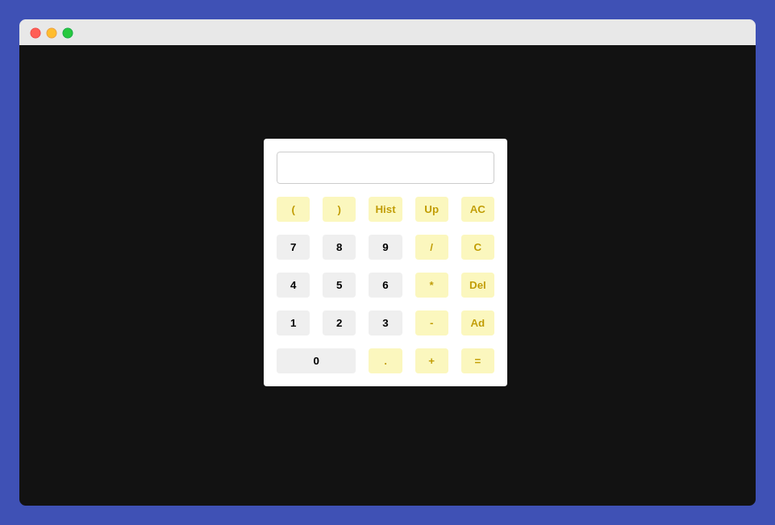

# Projeto React - Conceitos Básicos

## Scripts Disponíveis

Para rodar o projeto clone ou baixe o arquivo .zip, descompacte e dentro da pasta rode o comando no terminal.

### `yarn start` | npm run start

Execute o aplicativo em modo de desenvolvimento.
Abra [http://localhost:3000](http://localhost:3000) para visualizá-lo no navegador.

## O Projeto aborda os conceitos básicos de uma aplicação React:

- JSX
- Arrow Functions
- Funções
- Componentização
- Estados
- Fluxo de Dados
- Efeitos Colterais (SideEffects)
- Componentes Controlados & Não Controlados
- Tratamento de Estados através de Eventos
- Concorrência

## Funcionalidade Implementadas Calculadora

- Soma, Adição Subtração, Multiplicação e Divisão
- Limpar Display (C)
- Deletar Item (Del)
- Abrir Teclas Avançadas (Ad)
  - Parentêses
  - Histórico
  - Retroceder no Histórico
  - Apagar Tudo
- Resultados
- Tratamento de Erros
